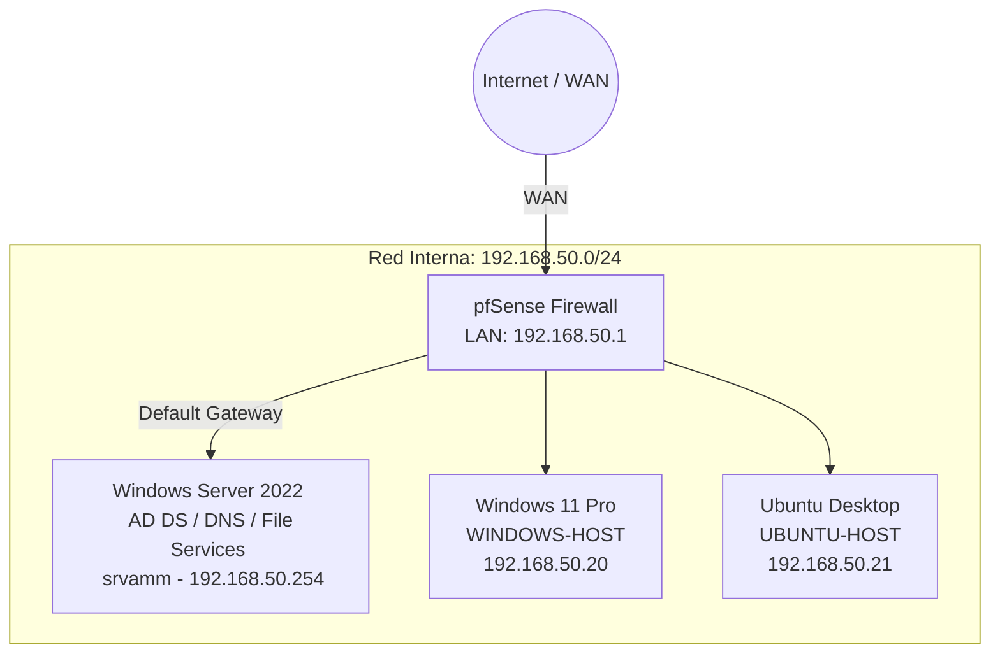

# Hybrid Enterprise Network Architecture & Secure Perimeter (pfSense + AD DS + Linux Integration)

📌 **Project Overview**

Design, implementation, and hardening of a hybrid enterprise network infrastructure secured by a pfSense perimeter firewall, integrated with an Active Directory Domain Services (AD DS) core. This project demonstrates cross-platform identity management, Role-Based Access Control (RBAC), secure routing, and resource protection across Windows Server 2022, Windows 11 Pro, and Ubuntu Desktop environments virtualized on VMware Workstation Pro.

---

## 🏗️ Network & Environment Topology (`192.168.50.0/24`)

* **Perimeter Firewall & Router:** pfSense (WAN: External / LAN: `192.168.50.1` - Default Gateway)
* **Domain Controller, DNS & Storage:** Windows Server 2022 (`192.168.50.254` - `srvamm.agmimo.local`)
* **Domain Name:** `agmimo.local`
* **Windows Client:** Windows 11 Pro (`192.168.50.20` - `WINDOWS-HOST`)
* **Linux Client:** Ubuntu Desktop (`192.168.50.21` - `UBUNTU-HOST`)
* **Virtualization:** VMware Workstation Pro

---

## 🛠️ Key Implementation Highlights

### 1. Perimeter Security & Routing (pfSense)
* **Interface Management:** Configured dual-interface setup (WAN for upstream internet connectivity and LAN `192.168.50.1` acting as the network's default gateway).
* **Static IP Allocation:** Enforced structured static IP addressing across internal infrastructure components (`192.168.50.254`, `192.168.50.20`, `192.168.50.21`).
* **Firewall Rules & NAT:** Configured outbound NAT and baseline firewall rule sets to safely route internal traffic while controlling external exposure.

### 2. Active Directory DS & Infrastructure Core
* **Core Roles:** Installed Active Directory Domain Services, DNS Controller, and File & Storage Services on `srvamm`.
* **DNS Services:** Primary lookup zone configuration (`agmimo.local`), forwarders, and custom reverse lookup zone (`50.168.192.in-addr.arpa`) mapped to `192.168.50.254` with automated PTR record registration.
* **Service Discovery:** Delegation and maintenance of `_msdcs.agmimo.local` SRV records for Kerberos and LDAP resolution.

### 3. Organizational Units & Access Control (RBAC)
* **Structured OUs:** Designed a hierarchical structure with top-level OU `EnterpriseLab` containing sub-OUs `Groups` and `Users`.
* **Security Groups:** Created department-specific groups: `HR Department`, `IT Department`, and `Sales Department`.
* **Privilege Delegation:** Granted Remote Desktop (RDP) access on `srvamm` to members of the `IT Department` security group.

### 4. File Services & Network Share Hardening
* **Administrative Hidden Shares:** Deployed hidden SMB shares (`sales-folder$` and `hr-folder$`).
* **Dual-Layer Security:** Implemented combined NTFS and SMB Share Permissions enforcing the principle of least privilege:
  * `sales-folder$`: SMB Shared Access with Read and Write permissions assigned to the `Sales Department` security group.
  * `hr-folder$`: Granular NTFS Full Access assigned exclusively to the `HR Department` security group.

### 5. Cross-Platform Integration & Automation
* **Linux Domain Binding:** Joined `UBUNTU-HOST` (`192.168.50.21`) to `agmimo.local` using `realmd`, `sssd`, `adcli`, and `krb5` via automated Bash scripting.
* **Windows Domain Binding:** Joined `WINDOWS-HOST` (`192.168.50.20`) to `agmimo.local` via automated PowerShell scripting.
* **PAM Configuration:** Configured Pluggable Authentication Modules (`pam-auth-update`) on Ubuntu for automatic home directory creation upon domain user sign-in (`mkhomedir`).
* **SSSD & Kerberos:** Enabled Kerberos ticket caching and domain credential validation for Linux client login.

---

## 🧪 Testing & Validation

* **Internet & Gateway Routing:** Verified end-to-end traffic routing from domain clients through pfSense (`192.168.50.1`).
* **Domain Authentication:** Successfully logged into Windows 11 (`WINDOWS-HOST`) and Ubuntu (`UBUNTU-HOST`) using AD domain accounts (`user@agmimo.local`).
* **Remote Management:** Validated RDP connectivity to `srvamm` using authorized `IT Department` credentials.
* **Name Resolution:** Checked DNS forward and reverse lookups (`nslookup srvamm.agmimo.local`) across all domain endpoints.
* **Storage Access:** Confirmed read/write access to `\\srvamm\sales-folder$` for `Sales Department` users and verified full NTFS permission boundaries on `\\srvamm\hr-folder$` for `HR Department` members.
