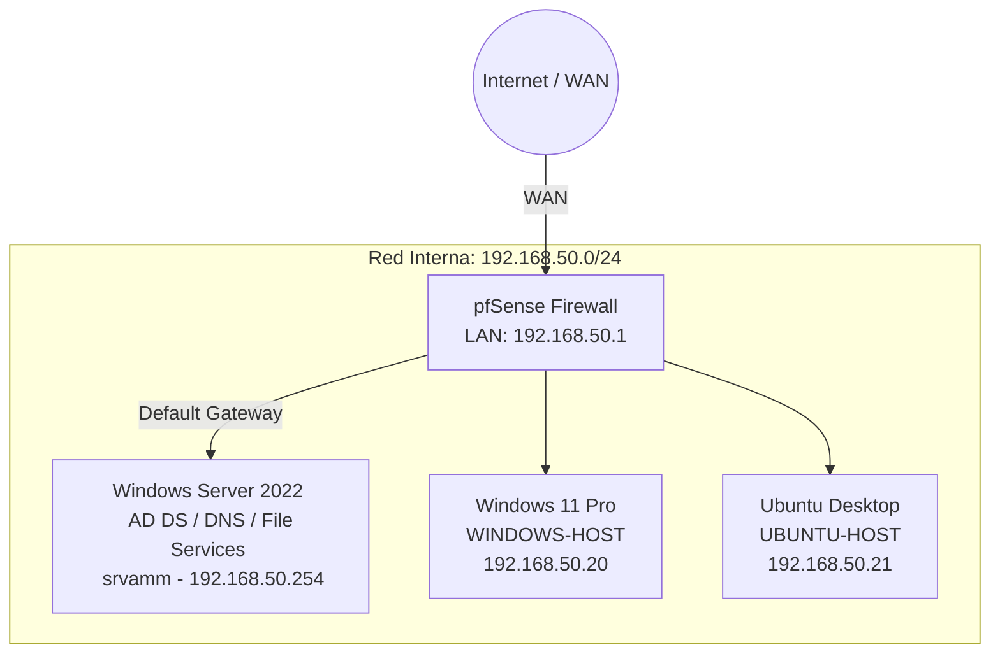

# Active Directory, Networking and Linux Integration Lab

## Project Overview

This project is a virtual home lab created to practice fundamental concepts related to networking, identity management, system administration, and access control.

The environment was built using VMware Workstation Pro and includes:

- pfSense as the network firewall and default gateway
- Windows Server 2022 running Active Directory Domain Services and DNS
- Windows 11 Pro joined to the Active Directory domain
- Ubuntu Desktop integrated with Active Directory
- Department-based users, groups, and file permissions

The main goal of this project was to understand how network infrastructure, centralized authentication, and role-based access control work together in a small multi-platform environment.

> This is an educational lab designed for hands-on learning. It is not intended to represent a production-ready enterprise environment.

---

## Lab Objectives

The objectives of this project were to:

- Build a functional Active Directory domain
- Configure centralized DNS resolution
- Join Windows and Linux clients to the domain
- Organize users and groups using Organizational Units
- Apply Role-Based Access Control through security groups
- Configure SMB shares with NTFS and share permissions
- Restrict Remote Desktop access to authorized users
- Configure basic firewall rules, routing, and outbound NAT
- Validate authentication, connectivity, and access permissions
- Practice basic automation using PowerShell and Bash

---

## Technologies Used

| Technology | Purpose |
|---|---|
| VMware Workstation Pro | Virtualization platform |
| pfSense | Firewall, router, NAT, and default gateway |
| Windows Server 2022 | Domain Controller, DNS, and file services |
| Active Directory Domain Services | Centralized identity and access management |
| Windows 11 Pro | Windows domain client |
| Ubuntu Desktop | Linux domain client |
| PowerShell | Windows configuration and automation |
| Bash | Linux domain integration |
| Kerberos | Domain authentication |
| SSSD | Linux identity and authentication services |
| PAM | Linux authentication and home directory configuration |
| SMB and NTFS | Shared-resource access control |

---

## Network Topology

### Internal Network

