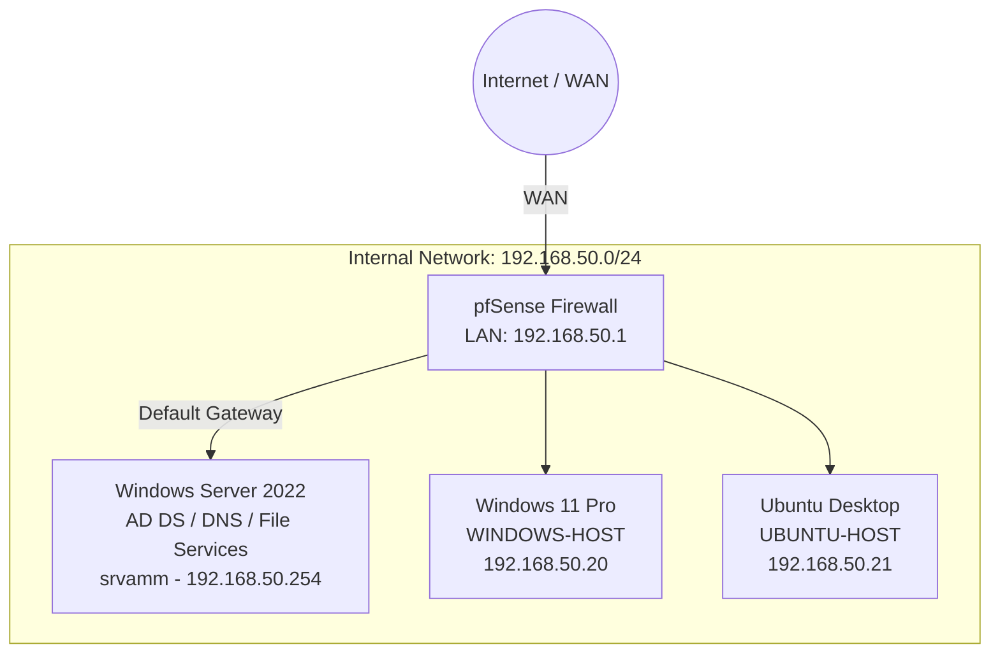

# Active Directory, Networking and Linux Integration Lab

## Project Overview

This project is a virtual home lab created to practice fundamental concepts related to networking, identity management, system administration, and access control.

The environment was built using VMware Workstation Pro and includes:

- pfSense as the network firewall and default gateway
- Windows Server 2022 running Active Directory Domain Services and DNS
- Windows 11 Pro joined to the Active Directory domain
- Ubuntu Desktop integrated with Active Directory
- Department-based users, groups, and file permissions

The main goal of this project was to understand how network infrastructure, centralized authentication, and role-based access control work together in a small multi-platform environment.

> This is an educational lab designed for hands-on learning. It is not intended to represent a production-ready enterprise environment.

---

## Lab Objectives

The objectives of this project were to:

- Build a functional Active Directory domain
- Configure centralized DNS resolution
- Join Windows and Linux clients to the domain
- Organize users and groups using Organizational Units
- Apply Role-Based Access Control through security groups
- Configure SMB shares with NTFS and share permissions
- Restrict Remote Desktop access to authorized users
- Configure basic firewall rules, routing, and outbound NAT
- Validate authentication, connectivity, and access permissions
- Practice basic automation using PowerShell and Bash

---

## Technologies Used

| Technology | Purpose |
|---|---|
| VMware Workstation Pro | Virtualization platform |
| pfSense | Firewall, router, NAT, and default gateway |
| Windows Server 2022 | Domain Controller, DNS, and file services |
| Active Directory Domain Services | Centralized identity and access management |
| Windows 11 Pro | Windows domain client |
| Ubuntu Desktop | Linux domain client |
| PowerShell | Windows configuration and automation |
| Bash | Linux domain integration |
| Kerberos | Domain authentication |
| SSSD | Linux identity and authentication services |
| PAM | Linux authentication and home directory configuration |
| SMB and NTFS | Shared-resource access control |

---

## Network Topology

### Internal Network

```text
Network: 192.168.50.0/24
```

### Systems

| System | Role | Hostname | IP Address |
|---|---|---|---|
| pfSense | Firewall and Default Gateway | pfSense | 192.168.50.1 |
| Windows Server 2022 | AD DS, DNS, and File Services | srvamm | 192.168.50.254 |
| Windows 11 Pro | Windows Domain Client | WINDOWS-HOST | 192.168.50.20 |
| Ubuntu Desktop | Linux Domain Client | UBUNTU-HOST | 192.168.50.21 |

### Domain Information

```text
Domain: agmimo.local
Domain Controller: srvamm.agmimo.local
```

### Topology Diagram



---

## Implementation

### 1. pfSense Firewall and Routing

pfSense was configured with two virtual network interfaces:

- **WAN interface:** Provides upstream network and internet connectivity
- **LAN interface:** Connects the internal lab network

The LAN interface uses the following address:

```text
192.168.50.1
```

pfSense acts as the default gateway for the internal systems.

The configuration includes:

- Basic LAN and WAN interface configuration
- Outbound NAT
- Basic firewall rules
- Internal-to-external traffic routing
- Static IP addressing for the lab systems

This configuration provided a controlled point for managing connectivity between the internal network and the external network.

---

### 2. Active Directory Domain Services

Windows Server 2022 was configured with the following roles:

- Active Directory Domain Services
- DNS Server
- File and Storage Services

The server was promoted as the Domain Controller for:

```text
agmimo.local
```

The Domain Controller uses:

```text
Hostname: srvamm
FQDN: srvamm.agmimo.local
IP address: 192.168.50.254
```

This server provides centralized authentication, DNS resolution, and access to shared resources.

---

### 3. DNS Configuration

DNS was configured on Windows Server 2022 to support Active Directory and domain-client communication.

The configuration includes:

- Forward lookup zone for `agmimo.local`
- Reverse lookup zone for `192.168.50.0/24`
- DNS forwarders for external name resolution
- PTR record registration
- Active Directory service records for Kerberos and LDAP discovery

The reverse lookup zone is:

```text
50.168.192.in-addr.arpa
```

DNS functionality was validated from the Windows and Ubuntu clients.

Example validation command:

```powershell
nslookup srvamm.agmimo.local
```

---

### 4. Organizational Units and Security Groups

A basic Organizational Unit structure was created to organize domain objects.

```text
EnterpriseLab
├── Groups
└── Users
```

Department-based security groups were created for:

- IT Department
- HR Department
- Sales Department

These groups were used to assign access according to each department instead of assigning permissions directly to individual users.

This approach helped me practice the fundamentals of Role-Based Access Control and the principle of least privilege.

---

### 5. Windows 11 Domain Integration

The Windows 11 Pro client was configured with a static IP address and the Domain Controller as its DNS server.

```text
Hostname: WINDOWS-HOST
IP address: 192.168.50.20
DNS server: 192.168.50.254
```

The computer was then joined to:

```text
agmimo.local
```

After joining the domain, authentication was tested using an Active Directory domain account.

Some Windows configuration steps were automated using PowerShell.

---

### 6. Ubuntu Domain Integration

The Ubuntu Desktop client was joined to the Active Directory domain to practice cross-platform authentication.

```text
Hostname: UBUNTU-HOST
IP address: 192.168.50.21
DNS server: 192.168.50.254
```

The integration uses:

- `realmd`
- `sssd`
- `adcli`
- `krb5`
- PAM

Kerberos was used for domain authentication, while SSSD was configured to retrieve domain identities and validate user credentials.

PAM was configured to automatically create a local home directory when a domain user signs in for the first time.

```bash
pam-auth-update
```

Domain discovery and integration steps were automated using a Bash script.

---

### 7. File Services and Access Control

Hidden SMB shares were created on Windows Server 2022:

```text
sales-folder$
hr-folder$
```

Access was controlled using a combination of:

- SMB share permissions
- NTFS permissions
- Active Directory security-group membership

The Sales Department security group was granted the required access to:

```text
\\srvamm\sales-folder$
```

The HR Department security group was granted the required access to:

```text
\\srvamm\hr-folder$
```

This configuration allowed me to practice how share permissions, NTFS permissions, and group membership work together to control access to network resources.

---

### 8. Remote Desktop Access

Remote Desktop access to the Windows Server was restricted to authorized users.

Members of the following security group were granted RDP access:

```text
IT Department
```

This configuration was used to practice privilege delegation and group-based access management.

---

## Automation

The repository includes scripts used to support parts of the lab configuration.

### PowerShell

PowerShell was used to automate Windows configuration tasks, including domain-client configuration.

### Bash

Bash was used to support the Ubuntu domain-join process and configure the packages required for Active Directory authentication.

The scripts are intended for educational use and should be reviewed before being used in a different environment.

---

## Testing and Validation

The following tests were performed to validate the lab.

### Network Connectivity

- Verified connectivity between the virtual systems
- Confirmed that clients use pfSense as their default gateway
- Confirmed external connectivity through outbound NAT

### DNS Resolution

- Verified forward DNS resolution
- Verified reverse DNS resolution
- Confirmed that clients use the Domain Controller as their DNS server

### Domain Authentication

- Signed in to Windows 11 using an Active Directory account
- Signed in to Ubuntu using an Active Directory account
- Validated Kerberos authentication on the Linux client

Example account format:

```text
user@agmimo.local
```

### File-Share Permissions

- Confirmed access to the Sales share using a Sales Department account
- Confirmed access to the HR share using an HR Department account
- Validated that access was determined by security-group membership

### Remote Desktop

- Verified RDP connectivity using an authorized IT Department account
- Confirmed that remote access was limited to the intended security group

---

## Key Learnings

This project helped me strengthen my understanding of:

- Active Directory domain deployment
- Centralized identity management
- Authentication and authorization
- Organizational Units and security groups
- Role-Based Access Control
- DNS requirements for Active Directory
- Windows and Linux domain integration
- Kerberos, SSSD, and PAM
- SMB and NTFS permission management
- Basic firewall rules, NAT, and routing
- PowerShell and Bash automation
- Technical testing and troubleshooting

It also helped me connect concepts from IT support, networking, identity management, and cybersecurity in a practical environment.

---

## Current Scope and Limitations

This project currently focuses on a single-domain educational environment.

The following production-level components are outside the current scope:

- Active Directory redundancy
- Multiple Domain Controllers
- High availability
- Centralized monitoring
- Backup and disaster recovery
- Public Key Infrastructure
- Advanced Group Policy security baselines
- Multi-network segmentation using VLANs
- Cloud identity synchronization
- Production firewall hardening

Clearly defining these limitations helps distinguish the completed lab from a production enterprise deployment.

---

## Possible Next Steps

Future improvements may include:

- Creating and testing Group Policy Objects
- Adding password and account-lockout policies
- Implementing Windows security auditing
- Reviewing SMB security settings
- Creating separate network segments
- Adding centralized logging and monitoring
- Testing firewall rules between network segments
- Adding a second Domain Controller
- Exploring Microsoft Entra ID integration
- Expanding PowerShell automation
- Documenting troubleshooting scenarios

---

## Repository Structure

```text
enterprise-ad-lab/
├── README.md
└── scripts/
    ├── PowerShell scripts
    └── Bash scripts
```

---

## Disclaimer

This project was created in an isolated virtual environment for educational and professional-development purposes.

The domain names, users, groups, IP addresses, and configurations are part of a lab environment and should be adapted before being used elsewhere.
