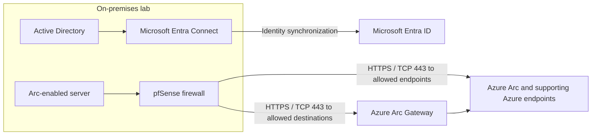

# Cloud Integrations

## Project Overview

This lab integrates on-premises Active Directory (AD) with Microsoft Entra ID using Microsoft Entra Connect and uses an Azure Arc Gateway to provide cloud connectivity for a Windows Server. The custom domain `agmimo.college` is configured as an AD user principal name (UPN) suffix. Outbound access is restricted with pfSense rules so the local server does not need to be exposed directly to the Internet.

## Objectives

- Synchronize on-premises identities with Microsoft Entra ID.
- Use the custom `agmimo.college` domain for user identities.
- Apply least privilege to the service accounts used for synchronization.
- Connect the local server to Azure through an Azure Arc Gateway without directly exposing it to the Internet.
- Allow only the outbound destinations required for the integration.

## Architecture / Topology

Microsoft Entra Connect is enabled and identity synchronization is currently working. The synchronization service account described below was used for the initial synchronization setup and is now disabled. The Windows Server was connected to Azure Arc through the configured gateway.

### pfSense Aliases and Endpoints

| Alias | Configured destinations |
| --- | --- |
| `AzureArcEndpoint` | `gw.arc.azure.com`, `login.microsoftonline.com`, `management.azure.com`, `servicebus.windows.net`, `blob.core.windows.net`, `monitor.azure.com`, `ods.opinsights.azure.com`, `westus3.login.microsoft.com`, `gbl.his.arc.azure.com` |
| `AzureArcGateway` | `<my-gateway>.gw.arc.azure.com` |

pfSense permits outbound HTTPS (TCP port 443) from the Windows Server to the configured Azure Arc endpoints and to the Azure Arc Gateway. Other outbound Internet traffic remains blocked. The gateway FQDN shown above is a placeholder; replace it with the actual FQDN only if it is appropriate to publish it in this repository.

## Implementation Steps

1. Registered `agmimo.college` with Spaceship.
2. Added `agmimo.college` as a UPN suffix in Active Directory for identities intended to synchronize with Microsoft Entra ID.
3. Installed and configured Microsoft Entra Connect to synchronize identities from on-premises AD to Microsoft Entra ID.
4. Created service accounts in Active Directory and Microsoft Entra ID with minimum permissions for the initial synchronization setup. The initial-use service account was disabled after setup; Microsoft Entra Connect remains enabled and synchronization is currently working.
5. Provisioned an Azure Arc Gateway in the Azure portal.
6. Created the `AzureArcEndpoint` and `AzureArcGateway` aliases in pfSense with the destinations listed above.
7. Added pfSense `Allow` rules for outbound HTTPS (TCP port 443) from the Windows Server to the Azure Arc endpoints and gateway, while keeping other outbound Internet traffic blocked.
8. Ran `azcmagent connect` on the Windows Server, providing the resource group, tenant ID, Azure region, and gateway URL.

## Security Considerations

- Follow the principle of least privilege for synchronization identities.
- The account used for the initial synchronization setup is disabled. Microsoft Entra Connect is currently enabled and synchronization is working.
- Restrict outbound traffic from the Windows Server to the required destinations over HTTPS (TCP port 443) using pfSense aliases and rules.
- Do not expose the local server directly to the Internet for this integration.
- Avoid committing credentials, account names, or sensitive gateway details to source control.
- Periodically review the endpoint list and firewall rules against current Azure Arc requirements.

## Testing and Validation

- Microsoft Entra Connect is enabled, and identity synchronization is currently working.
- Ran `azcmagent check` on the Windows Server to check Azure Arc connectivity.
- Reviewed pfSense logs and confirmed HTTPS (TCP port 443) traffic was allowed only to the configured gateway and endpoints.
- Confirmed in the Azure portal that the server appeared as **Connected via Arc Gateway**.
- The server uses outbound connectivity through the gateway and permitted endpoints; it is not directly exposed to the Internet for this integration.

## Limitations

- Intune enrollment and Conditional Access policies are not documented as implemented in this lab.
- This README records the lab configuration and validation reported for it; it does not document a production deployment or its operational controls.

## Next Steps

- Evaluate and test automatic enrollment in Intune.
- Evaluate and test Conditional Access policies.
- Explore automating setup and validation with PowerShell and/or Azure CLI.
